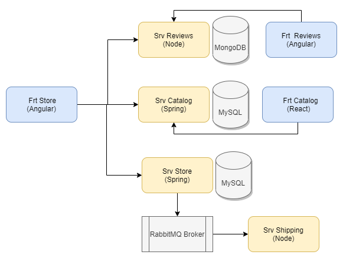

# Book Store App - Aplicación Basada en Microservicios

Esta aplicación de "Libreria Virtual" pretende servir como herramienta de aprendizaje de temas como microservicios, despliegue basado en contenedores (Docker) y orquestación de contenedores (Kubernetes).

En el siguiente diagrama se presenta la arquitectura general de la aplicación:

## Descripción

El proyecto está construido en 4 fases, como se presenta a continuación:

### Fase 1:
Consta de 2 microservicios y 2 frontends 

- backend-library-catalog : Backend Catalogo de libros (Springboot)
- backend-reviews : Backend Reviews de lectores (Node + Express)
- frontend-catalog-library : Frontend Catalogo de libros (React)
- frontend-reviews : Frontend Reviews de lectores (Angular)

En esta fase los microservicios no tienen persistencia, los datos son almacenados en memoria RAM

### Fase 2:
Esta fase es similar a la anterior con la diferencia que los microservicios tiene persistencia
- backend-library-catalog : Backend Catalogo de libros (Springboot + MySQL)
- backend-reviews : Backend Reviews de lectores (Node + Express + MongoDB)
- frontend-catalog-library : Frontend Catalogo de libros (React)
- frontend-reviews : Frontend Reviews de lectores (Angular)

### Fase 3:
En esta fase se agrega a los microservicios de la fase 2 un microservicio store (la tienda) y su respectivo frontend
- backend-library-catalog : Backend Catalogo de libros (Springboot + MySQL)
- backend-reviews : Backend Reviews de lectores (Node + Express + MongoDB)
- frontend-catalog-library : Frontend Catalogo de libros (React)
- frontend-reviews : Frontend Reviews de lectores (Angular)
- backend-store : Backend de la tienda de libros (Springboot + MySQL)
- frontend-store : Frontend Reviews de lectores (Angular)

### Fase 4:
En esta fase se agrega a los microservicios de la fase 3 un microservicio shipping (entrega) que se integrará mediente un middleware de mensajeria
- backend-library-catalog : Backend Catalogo de libros (Springboot + MySQL)
- backend-reviews : Backend Reviews de lectores (Node + Express + MongoDB)
- frontend-catalog-library : Frontend Catalogo de libros (React)
- frontend-reviews : Frontend Reviews de lectores (Angular)
- backend-store : Backend de la tienda de libros (Springboot + MySQL)
- frontend-store : Frontend Reviews de lectores (Angular)
- backend-shipping : Backend de servico de entrega de los libros comprados (Node + Express)

## Estructura de directorios

- Los frontends se encuentran en el directorio [frontends](frontends/)
- Los backends con persistencia se encuentran en el directio [backends](backends/), la versión simple (en memoria) en  [backends/in-memory](backends/in-memory) y la versión persistente en  [backends/persistent](backends/persistent)

